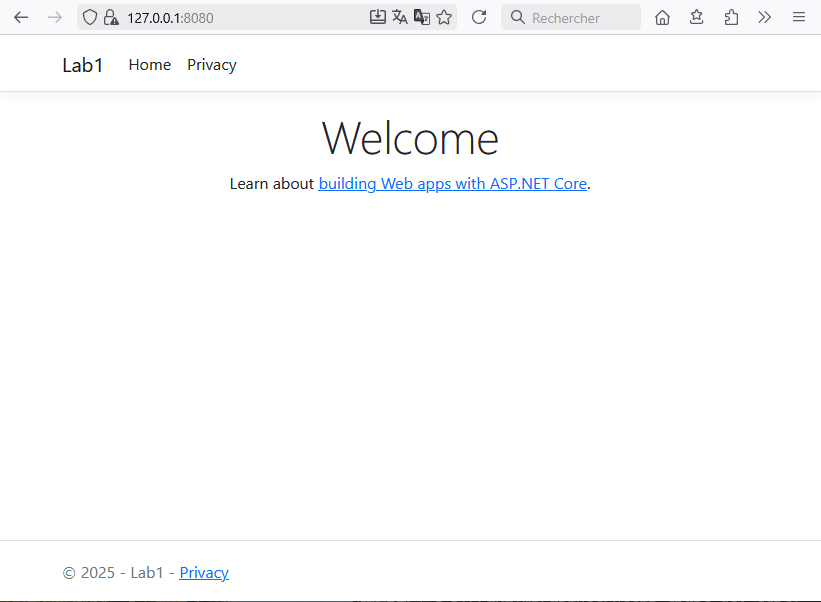
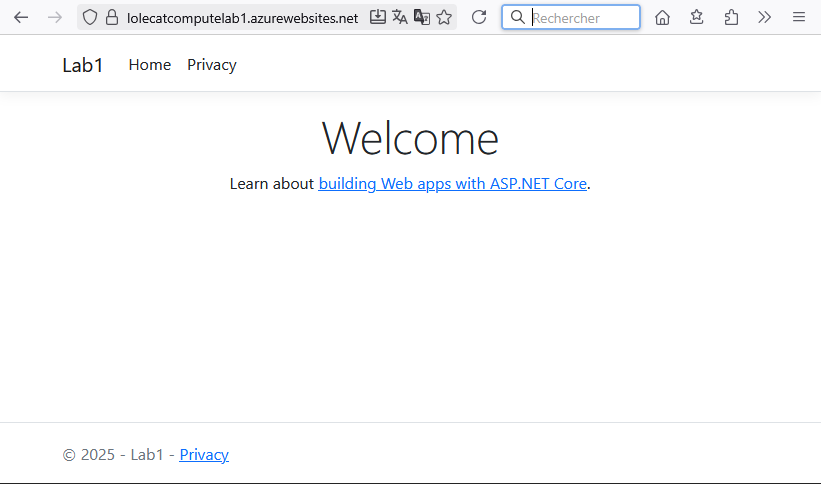

https://learn.microsoft.com/en-us/azure/app-service/quickstart-dotnetcore?tabs=net80&pivots=development-environment-ps

***If needed, install the .Net SDK, at least version 8 :***
```
# On Windows
winget install Microsoft.DotNet.SDK.8
```

### 1/ Create the .Net App  
```
cd ~/Louis/Desktop
mkdir WebApp
cd ./WebApp
dotnet new webapp -n Lab1 --framework net8.0
cd .\Lab1\ && gci

    Directory: C:\Users\Louis\Desktop\WebApp\Lab1

    Mode                 LastWriteTime         Length Name
    ----                 -------------         ------ ----
    d----          10/10/2025    21:15                obj
    d----          10/10/2025    21:15                Pages
    d----          10/10/2025    21:15                Properties
    d----          10/10/2025    21:15                wwwroot
    -a---          10/10/2025    21:15            154 appsettings.Development.json
    -a---          10/10/2025    21:15            151 appsettings.json
    -a---          10/10/2025    21:15            219 Lab1.csproj
    -a---          10/10/2025    21:15            573 Program.cs
```

#### Running the application locally   
```
dotnet run --urls=https://localhost:8080/

info: Microsoft.Hosting.Lifetime[14]
      Now listening on: https://localhost:8080
info: Microsoft.Hosting.Lifetime[0]
      Application started. Press Ctrl+C to shut down.
info: Microsoft.Hosting.Lifetime[0]
      Hosting environment: Development
info: Microsoft.Hosting.Lifetime[0]
      Content root path: C:\Users\Louis\Desktop\WebApp\Lab1
```

#### Testing  

Via a terminal :
```
Invoke-WebRequest -Uri "https://127.0.0.1:8080" -SkipCertificateCheck

    StatusCode        : 200
    StatusDescription : OK
    Content           : <!DOCTYPE html>
                        <html lang="en">
                        <head>
                            <meta charset="utf-8" />
                            <meta name="viewport" content="width=device-width, initial-scale=1.0" />
                            <title>Home page - Lab1</title>
                            <link re…
    RawContent        : HTTP/1.1 200 OK
                        Date: Fri, 10 Oct 2025 19:32:19 GMT
                        Server: Kestrel
                        Transfer-Encoding: chunked
                        Content-Type: text/html; charset=utf-8

                        <!DOCTYPE html>
                        <html lang="en">
                        <head>
                            <meta charse…
    Headers           : {[Date, System.String[]], [Server, System.String[]], [Transfer-Encoding, System.String[]], [Content-Type,
                        System.String[]]}
    Images            : {}
    InputFields       : {}
    Links             : {@{outerHTML=<a class="navbar-brand" href="/">Lab1</a>; tagName=A; class=navbar-brand; href=/}, @{outerHTML=<a
                        class="nav-link text-dark" href="/">Home</a>; tagName=A; class=nav-link text-dark; href=/}, @{outerHTML=<a
                        class="nav-link text-dark" href="/Privacy">Privacy</a>; tagName=A; class=nav-link text-dark; href=/Privacy},
                        @{outerHTML=<a href="https://learn.microsoft.com/aspnet/core">building Web apps with ASP.NET Core</a>; tagName=A;
                        href=https://learn.microsoft.com/aspnet/core}…}
    RawContentLength  : 2525
    RelationLink      : {}
```

Or a web browser :  



### 2/ Create the Azure WebApp  

#### Resource group 
```powershell
New-AzResourceGroup -Name "compute_lab1" -Location "francecentral"
```

#### WebApp  
```powershell
$webApp = @{
    Name                = "lolecatcomputelab1"
    Location            = "francecentral"
    ResourceGroupName   = "compute_lab1"
}
New-AzWebApp @webApp
```

Output  (some of it)
``` 
State                       : Running
HostNames                   : {lolecatcomputelab1.azurewebsites.net}
RepositorySiteName          : lolecatcomputelab1
UsageState                  : Normal
Enabled                     : True
EnabledHostNames            : {lolecatcomputelab1.azurewebsites.net, lolecatcomputelab1.scm.azurewebsites.net}
AvailabilityState           : Normal
HostNameSslStates           : {lolecatcomputelab1.azurewebsites.net, lolecatcomputelab1.scm.azurewebsites.net}
ServerFarmId                : /subscriptions/ed2c2943-1a1b-4330-a161-2d2b8afd9fe5/resourceGroups/compute_lab1/providers/Microsoft.Web/serverfarms/lolecatcomputelab1
Reserved                    : False
IsXenon                     : False
LastModifiedTimeUtc         : 10/10/2025 20:08:02
SiteConfig                  : Microsoft.Azure.Management.WebSites.Models.SiteConfig
TrafficManagerHostNames     : 
ScmSiteAlsoStopped          : False
TargetSwapSlot              : 
HostingEnvironmentProfile   : 
ClientAffinityEnabled       : True
ClientCertEnabled           : False
HostNamesDisabled           : False
ResourceGroup               : compute_lab1
DefaultHostName             : lolecatcomputelab1.azurewebsites.net
SlotSwapStatus              : 
HttpsOnly                   : False
Id                          : /subscriptions/<...>/resourceGroups/compute_lab1/providers/Microsoft.Web/sites/lolecatcomputelab1
Name                        : lolecatcomputelab1
Kind                        : app
Location                    : francecentral
Type                        : Microsoft.Web/sites
Tags                        :
```

### 3/ Create an App release and publish it to the WebApp  

#### Create the app release and its zip file
```
dotnet publish --configuration Release
  Identification des projets à restaurer...
  Tous les projets sont à jour pour la restauration.
  Lab1 -> C:\Users\Louis\Desktop\WebApp\Lab1\bin\Release\net8.0\Lab1.dll
  Lab1 -> C:\Users\Louis\Desktop\WebApp\Lab1\bin\Release\net8.0\publish\

cd ./bin/Release/net8.0/publish
Compress-Archive -Path * -DestinationPath deploy.zip
```

#### Pushing the release's zip file to the Azure WebApp
```powershell
$release = @{
    ArchivePath         = (Get-Item .\deploy.zip).FullName # ArchivePath parameter needs the full path of the file, that's why we're referencing to the .FullName property
    Name                = "lolecatcomputelab1"
    ResourceGroupName   = "compute_lab1"
}
Publish-AzWebApp @release -Force
```

#### Testing  

Via a terminal :  
```
Invoke-WebRequest -Uri "https://lolecatcomputelab1.azurewebsites.net"

    StatusCode        : 200
    StatusDescription : OK
    Content           : <!DOCTYPE html>
                        <html lang="en">
                        <head>
                            <meta charset="utf-8" />
                            <meta name="viewport" content="width=device-width, initial-scale=1.0" />
                            <title>Home page - Lab1</title>
                            <link re…
    RawContent        : HTTP/1.1 200 OK
                        Date: Fri, 10 Oct 2025 20:33:47 GMT
                        Server: Microsoft-IIS/10.0
                        Set-Cookie: ARRAffinity=931b9b281a0bf6880ba567a8225539233d83551cdcf66cf326b8e9858f84eb65;Path=/;HttpOnly;Secure;Domain…
    Headers           : {[Date, System.String[]], [Server, System.String[]], [Set-Cookie, System.String[]], [Transfer-Encoding,
                        System.String[]]…}
    Images            : {}
    InputFields       : {}
    Links             : {@{outerHTML=<a class="navbar-brand" href="/">Lab1</a>; tagName=A; class=navbar-brand; href=/}, @{outerHTML=<a
                        class="nav-link text-dark" href="/">Home</a>; tagName=A; class=nav-link text-dark; href=/}, @{outerHTML=<a
                        class="nav-link text-dark" href="/Privacy">Privacy</a>; tagName=A; class=nav-link text-dark; href=/Privacy},
                        @{outerHTML=<a href="https://learn.microsoft.com/aspnet/core">building Web apps with ASP.NET Core</a>; tagName=A;
                        href=https://learn.microsoft.com/aspnet/core}…}
    RawContentLength  : 2525
    RelationLink      : {}
```

Or a web browser :  



### 4/ Clean up

```powershell
Remove-AzResourceGroup -Name 'compute_lab1' -Force
```

